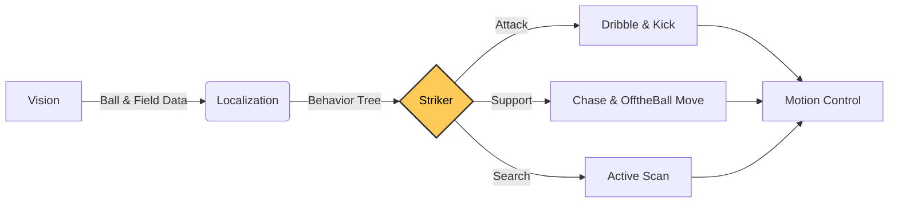

# :soccer: INHA Striker
**Advanced Autonomous Agent for Humanoid Soccer**

*Dynamic Decision Making • Tactical Positioning • Human-like Agility*

---

## Vision
**"To create a soccer-playing intelligence that doesn't just calculate, but *understands* the flow of the game."**

The **INHA Striker** is designed to bridge the gap between rigid robotic control and dynamic human intuition. By leveraging hierarchical behavior trees and advanced motion planning, our agent demonstrates adaptive gameplay—switching seamlessly between aggressive dribbling, tactical off-ball movement, and precision finishing.

---

## Key Features

### **Cognitive Flexibility**
Instead of simple if-else logic, we utilize a **Behavior Tree (BT)** architecture that allows for complex, reactive decision-making. The robot constantly evaluates the game state to transition between behaviors seamlessly.
*   **Reactive**: Handles interruptions (e.g., sudden ball loss) gracefully.
*   **Modular**: Easy to expand with new strategies or plays.

### **Fluid Agility**
We move beyond linear paths. Our **Curvilinear Approach** algorithms allow the robot to:
*   Approach the ball in smooth spirals rather than sharp turns.
*   Maintain momentum while aligning for a kick.
*   Execute **Swirl Maneuvers** to circle behind the ball naturally, mimicking human footwork.

### **Tactical Intelligence**
The striker knows where to be even when it doesn't have the ball.
*   **Symmetry-based Positioning**: Exploits open space by calculating optimal gaps relative to defender positions.
*   **Obstacle-Aware Dribbling**: Dynamically projects paths to find the safest route through a crowded defense.

### **Precision & Power**
*   **Kick Lock Mechanism**: Prevents action oscillation by committing to a shot once a high-confidence window is identified.
*   **Adaptive Head Tracking**: Smoothes out sensor noise for stable vision while tracking high-speed balls.

---

## System Architecture
    

---

## Striker Behavior Tree Overview

---

## Contribution
This project contributes to the field of humanoid robotics by:
1.  **Demonstrating Robust Autonomy**: Showing how behavior trees can handle the chaotic environment of a soccer match.
2.  **Implementing Human-inspired Motion**: Proving that curvilinear paths are superior to linear point-to-point navigation for bipedal robots.
3.  **Open Source Innovation**: Providing a modular, extensible C++ framework for future researchers in the RoboCup domain.

---

    <b>Built with by INHA United</b> 
    <i>Pushing the boundaries of Autonomous Soccer</i>

